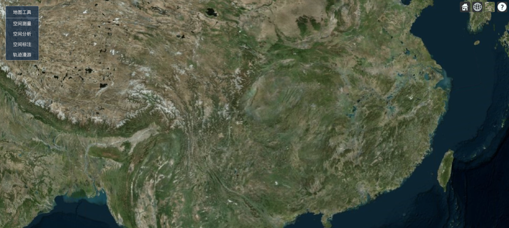

# cesium-tools

## install

```shell
npm install cesium-tools
```

## usage

```vue
<script setup lang="ts">
import { initCesiumTools, useCesiumTools } from 'cesium-tools'
import 'cesium-tools/index.css'
initCesiumTools(/** viwer instance */,/** options */)
const { measurePolyLine, measurePolygon } = useCesiumTools()
</script>
```

## preview


